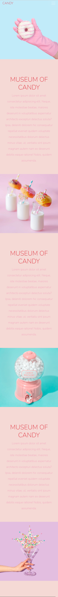

## Table of contents

- [Overview](#overview)
  - [The challenge](#the-challenge)
  - [Screenshot](#screenshot)
  - [Links](#links)
- [My process](#my-process)
  - [Built with](#built-with)

## Overview

### The challenge

Museum Of Candy Project from The Web Developer Bootcamp by Colt Steel

### Screenshots

#### Desctop

#### Mobile

### Link

- Live Site URL: [Live site URL](https://ania-sk.github.io/article-preview-component/)

## My process

### Built with

- Semantic HTML5 markup
- CSS custom properties
- Flexbox
- Mobile-first workflow
- Bootstrap
